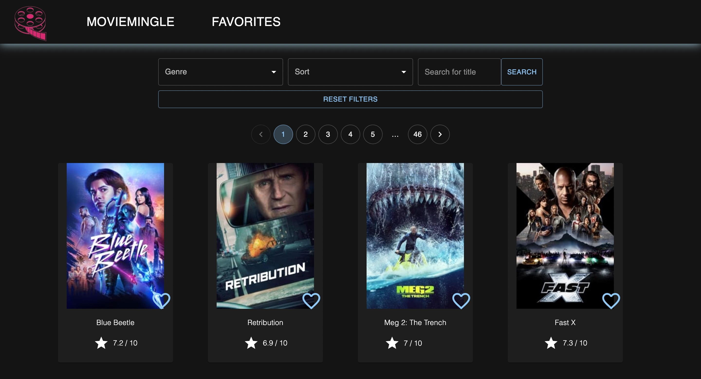
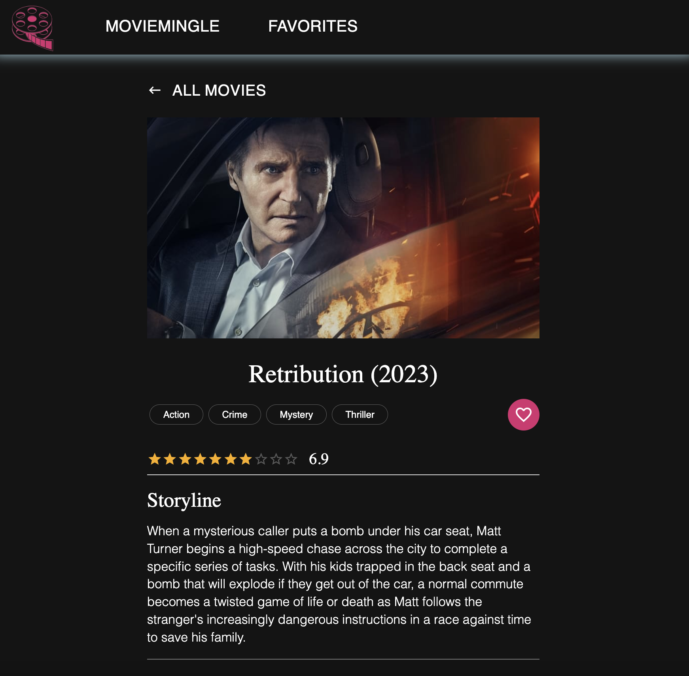

# Moviemingle

This README describes the project as a whole, you can view readme for server and client here:

- [Server README](./server/README.md)

- [Client README](./client/README.md)

## About the application

Welcome to our website Moviemingle, where you can explore a diverse selection of movies. Our functionalities empower you to discover movies by title, genre, alphabetically, and like and comment the movies. Our clean and user-friendly design focuses on delivering the ultimate cinematic experience. Explore movie information pages, leave comments, and enjoy an ambiance that transports you to a real movie theater. We've also prioritized accessibility and sustainability in our design, ensuring that everyone can enjoy our cinematic universe.

 <br>


## Enviroment

The system is built on node v20.5.0 and npm v9.8.1. It's necessary to have these versions installed to run the project locally.

```bash

nvm install 20.5.0

```

```bash

npm install -g npm@9.8.1

```

## NPM scripts

This section will provide the available npm scripts for the project.

Firstly, you must enter the location for the project

```bash

cd prosjekt-2

```

The next command is used in order to run the project

```bash

npm install

```

Next follow the instruction on how to run server and client in their respective README

NB! Server must be run first;

- [Server README](./server/README.md)

- [Client README](./client/README.md)

To ensure code formatting, you can run prettier:

```bash

npx prettier . -c

```

## Testing

To test, please visit the client documentation.

- [Client README](./client/README.md)

We have also user-tested the application on others that also have the couorse, since we know how easy it is to be blind on our own code.

## Filestructure

This project adheres to a defined file organization. This section offers a comprehensive explanation of the file structure and outlines the expected content within different directories and files.

- [Filestructure](./docs/filestructure.md)

## Responsiveness

We have styled the application to be responsive and fit different screen sizes. The testing has primarily happend on Google Chrome, which can resolve in some differences in other browsers. We have also not been able to test the application on larger screens than a normal Macbook.

## Web accessibility

The webpage is accessible for blind and visually impaired, with text to speech on each component. This can be tested using the crome screen reader extention, and tabbing through the site. Use tab to go forward, and tab+shift to go backwards.

Our testing on web accessibility is primarily done on Chrome, highlighting the need to recognize the boundaries of our testing scope. Consequently, we cannot be entirely certain about its performance in other browsers.

### API

We have chosen the api from TMDB(The Movie Database). We chose the API for its relevance, clear documentation, reliability, and alignment with our project's requirements and values.

### Components

Each component is inside a folder which the component and its respective CSS-file.

We broke down the components of our React project into small, reusable pieces. This gives us the possibility to further expand and maintain different features. It also promotes collaboration, as team members can work on separate components without interfering with each other.

## Functional requirements

### How we interpreted the functional requirements

<b> "Søkemulighet eks. med en dialog/form/søkefelt for input av søk"</b>

- Use the search field to find a movie by entering its title. If you've also selected a specific genre, the search will be refined to only include movies within that chosen genre

<b>"Listebasert presentasjon av søk hvor det er lagt opp til håndtering av store resultatsett med enten blaing i sider, eller dynamisk laster av flere resultater ved scrolling"</b>

- Pagination allows users to navigate through multiple pages by moving back and forth. This allows the user to travers through the movies.

<b>"Muligheten for å se mer detaljer om hvert av objektene"</b>

- By clicking on a movie, it is possible to read more about the movie including the plot, average rating and the movies genres.

<b>"Mulighet for sortering og filtrering av resultatsettet (merk at sortering og filtrering skal utføres på hele resultatsettet og ikke bare det som tilfeldigvis er laster inn på klienten)"</b>

- A user is able have the possibility to sort the content in either ascending(A-Z) or descendig(Z-A). Furthermore, the user can filter which genre they prefer.

<b>"Det skal inngå en eller annen form for brukergenererte data som skal lagres (persistent på databaseserveren) og presenteres (enten bruker som legger til informasjon, reviews, ratings etc, historikk om søkene eller annet, handleliste)"</b>

- A UUID is assigned to a user upon their initial visit to the page, and there is no requirement for the user to log in.

- A user can add comments to a chosen movie which are then stored in the database in relation to the movie.

- A user can add and remove favorite movies. This appears in a new page “My Favorites”, and are saved in the database with the users UUID.

<b>"Løsningen skal demonstrere aspekter ved universell utforming / web accessibility (tilgjengelighet)" </b>

- We have included features for blind and visually impaired users by implementing universal design that supports the Chrome screen reader, enabling tab navigation through elements, and providing clear definitions for enhanced accessibility. The user try this with the crome screen reader extention and tab through the page.

- Our design features high contrast, as we exclusively employ black and white styling, making the page accessible and user-friendly for individuals with visual impairments. Our dak-mode application is not only comfortable for the eye, but uses less energy.

<b>"Løsningen skal demonstrere aspekter ved bærekraftig webutvikling (gjennom valg som gjøres i design)"</b>

- We have employed reusable and well-structured code extensively throughout the project, and we have also utilized environmentally friendly color palettes in our design. To this delivery, we have reduced the amount of query calls to the database, to make the application more user friendly.

<b>"God design, fornuftige valg og løsninger som harmonerer med typen data dere velger"</b>

- Our styling is intentionally designed to emphasize and draw attention to the movie component. The color palette is curated to immerse users in the ambiance of a movie theater. Dark colors are particularly well-suited for elements associated with the cinematic experience.

<b>"Database og backend for prosjektet skal ved innlevering hostes på gruppas virtuelle maskin."</b>

- The database is hosted on our viritual machine

## Technical requirements

We have fulfilled the requirements by implementing the following:

1. The user interface is based on React and programmed in Typescript. The entire project is set up with Vite.

2. We have implemented state management using recoil.

3. The project has a custom developed GraphQL backend, and there is a backend database set up by the group.

4. We have selected and implemented good and relevant components and libraries in the project, and for this we use MUI, apollo server/client and react-router. We encourage the maximum possible reuse of third-party solutions to ensure efficiency and quality.

## Testing, Development, and Quality Control

We have fulfilled the requirements by implementing the following:

1. Linting and use of Prettier have been employed in the project.

2. Comprehensive testing of components has been conducted using Vitest.

3. An automated end-to-end testing approach has been implemented, practically testing a longer sequence of interactions, including the testing of the API. For this we have used cypress.

4. The project is documented with a README.md in the Git repository. The documentation discusses, explains, and references all key choices and solutions made by the group, including the selection of components and API.

5. We have had a focus on having a structured, easily understandable and commented-when-needed code.

6. We have delivered a summary of each of the group members contributions to the project via Blackboard.

7. The projects README files include documentation that hopefully will make the project easy to install and run.

## Changes from feedback

We got some feedback from on the last delivery, and we have done our best to implement those changes.

### Styling

We received feedback on our project and have implemented several changes to enhance the user experience. Among the updates are improved styling, adjustment of the shadow on the navigation bar with additional padding at the bottom, renaming "Default" sorting to "No sorting", adding pagination at the bottom of the list while avoiding a two-line display on smaller screens, implementing a hover effect on movie images, a thinner navigation bar with scaling of the MovieMingle icon, consistent font usage, adjustment of image sizes, customization for narrower screens, and a change in the color palette to a dark gray shade (#141414) instead of black. These changes are intended to address specific feedback received and improve both the visual and functional aspects of the project.

### Accessability

For accessibility, we received feedback that when tabbing through the page, users were double-tabbing on the navbar buttons due to nested elements. We addressed this issue by using the `tabIndex` attribute to control the tab order and ensure a more seamless navigation experience. By appropriately setting the tab index, we resolved the problem of users encountering redundant tab stops within the navbar buttons, improving the accessibility and usability of the page for individuals who rely on keyboard navigation.

### Functionality

For functionality, we received feedback suggesting the inclusion of multiple sorting options, and it was noted that either Prettier or Lint was running exclusively. We addressed this by incorporating sorting functionality based on sorting by rating. Additionally, we made adjustments to ensure both Prettier and Lint were functioning correctly. To enhance the user experience, we implemented visual indicators by adding rating stars in the list view, allowing users to easily identify and comprehend the sorting order based on ratings. These changes contribute to a more robust and user-friendly system, accommodating diverse sorting preferences and improving overall functionality.

### Testing

We received feedback that tests were failing on the singleFavButton, and we have addressed and fixed this issue. The necessary adjustments were made to ensure the proper functioning of the singleFavButton tests, resolving the reported failures.

### Other

In addition to the specific feedback mentioned earlier, we have made further improvements by adding comments to the code for better readability and understanding. Unnecessary div elements have been removed to streamline the structure. Regarding performance, it was noted that the Lighthouse score was quite low. The issue stemmed from generating "random" usernames for UUIDs, making it challenging to address without altering the entire process. While this particular aspect couldn't be rectified without a significant overhaul, we've taken steps to enhance code clarity, organization, and efficiency elsewhere in the project to mitigate potential performance issues. These updates contribute to a more maintainable and optimized codebase.
