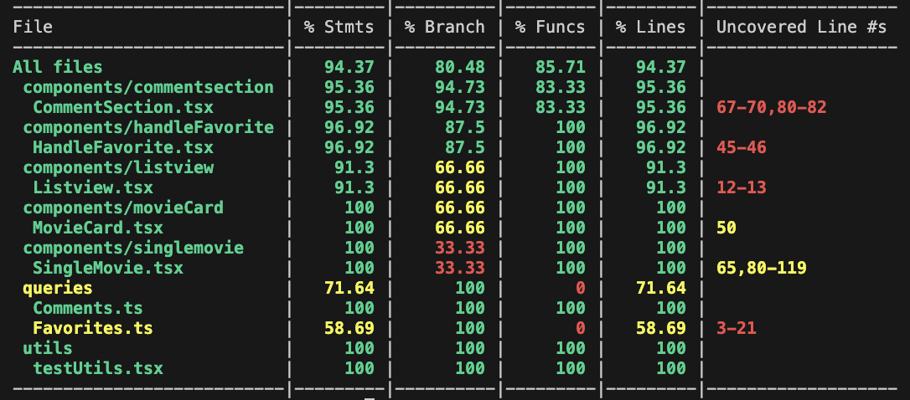

## About Client

The "client" folder within this project contains all the files and components related to the client-side of the application. It's responsible for creating the user interface, handling user interactions, and communicating with the server. Here, you'll find the frontend code, including React components, styles, and any client-specific functionality such as favorites and comments. This part of the project is what users interact with directly when they access the application through the web browser.

## How to run Client

Navigate to the "client" directory:

```bash
cd client
```

Install the required dependencies by running:

```bash
npm install
```

Start the client by executing this command within the "client" directory:

```bash
npm run dev
```

The app is now running at http://localhost:5174/

If you are having additional problems, please install the following packages:

````bash
npm i @apollo/client
npm i recoil
npm install uuidv4

### Additional commands:

The next command runs ESLint to check typescript for errors and code issues. Additionally, it will identify and report any unused ESLint-disable directives.

```bash
npm run lint
````

The next command will make it possible to fix some of the lint errors and warning, with the -–fix flag. This will be able to improve the code quality

```bash
npm run lint -- --fix
```

## Test enviroment

### Component testing

We have used the Vitest and React Testing Library. How to run the test for component:

```bash
npm install -D vitest
```

Installation to run the vitest

```bash
npm i --save-dev @types/jest
```

```bash
npm run test
```

It is also possible to check the coverage for the tests conducted:

```bash
npm run coverage
```

## Four component tests

We have chosen to test four very much relevant components.
All tests have contains the following:

- Snapshot tests
- Unit testing

### SingleMovie

#### Snapshot

There is created a snapshot test of singleMovie to make sure that the page renders correctly. This snapshot is found in the **snapshots** folder in the singlemovie-component file **test**.

#### Unit testing

We also check if the singlemovie has the correct content on the page. This is elements like heading, genres, storyline, correct poster and that the buttons are correct. We also check if the return button navigates to listview.

## Commentsection

#### Snapshot

There is created a snapshot test of commentSection to make sure that the page renders correctly. This snapshot is found in the **snapshots** folder in the commentSection-component file **test**.

#### Unit testing

We check if the commentsections elements is at the page after rendering with mock data. In addition, we have mocked the queries "add_comment" and "get_comment" to check if the queries works as we want them to.

## HandleFavorite

#### Snapshot

There is created a snapshot test of handleFavorite to make sure that the page renders correctly. This snapshot is found in the **snapshots** folder in the handleFavorite-component file **test**.

#### Unit testing

The test for handleFavorite checks if a movie is added to a users favoritePage by rendering a couple of movies in ListView. If the heart is filled we know the movie is added to favorite, and if it is not filled it is not in favorite.

## Listview

#### Snapshot

There is created a snapshot test of listview to make sure that the page renders correctly. This snapshot is found in the **snapshots** folder in the listview-component file **test**.

#### Unit testing

After rendering the listview with a couple movies we check if the movies are at the page.

## Test coverage

We have chosen not to tested the pages or the resolvers.

We have only checked test coverage for component testing.
The other components that we have not tested are not tested because we already test theese components in the other tests.

<b>Test coverage from client with vitest </b>



<b>Test coverage end to end tests </b>
The coverage is 0 in backend tests, this is because this gets tested in the e2e tests.

## End to end testing

We choose to cypress as our end to end as our testing tool. We had no experience with end to end testing beforehand, and cypress had an extensive amount of documentation. It was therefore a good alternative for us.

### Run e2e tests NB: REQUIRES CONNECTION TO NTNU VPN TO WORK

Keep in mind that this test takes ~1.5 minutes to complete. This is due to the fact that the tests are run and simulated through a browser, and that the browser needs to wait for the backend to respond to the requests.
To run the end-to-end tests, run the following command in the root of the project:

```bash
cd client
```

```bash
npm i --save-dev @types/cypress
```

```bash
npm audit fix
```

```bash
npx cypress run

```

Please be aware that test failures may occur due to potential delays in the backend response. In such cases, simply re-run the tests, as they are designed to automatically retry up to 3 times in case of failure, minimizing the likelihood of this occurrence.

Additionally, it's important to note that concurrent test runs by multiple individuals may lead to interference and subsequent failures. This is because the tests operate on the same database without a sandboxed environment. If you prematurely end a test run, it could leave the database in an inconsistent state, as the cleanup process may not be executed. In such instances, re-running the tests should resolve any issues and ensure successful completion.

If you encounter any other problems running the tests, make sure cypress is installed correctly before trying again.

Since we choose to automatically generate users in the application, there gets added a new user in the database for each test.
